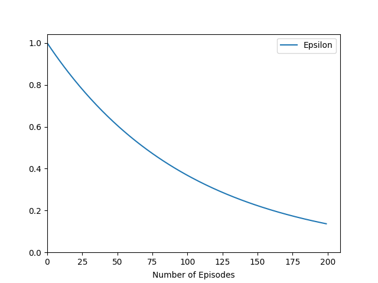

# A27_WideNeuralNetwork - TEST

This project is about exploring the possibilities of using Wide Neural Networks instead of Deep Nets in Reinforcement Learning. For this purpose we trained two Deep Q-Learning agents in an Agar.io-like environment, called 'Dots'.

## Implemented by

- Attila Pethő (maintainer) - <attilapetho13@gmail.com>
- Ákos Juhász - <juhasz.akos@edu.bme.hu>

## Sources and References

The game environment contains elements from this implementation of the Agar.io game:

<https://github.com/techwithtim/Agar-IO>

## Packages

To run the codes in this project you need the following packages installed:

- Numpy
- Pygame
- Pytorch
- Matplotlib
- IPython

## Environment

The game environment is a two-player version of the game Agar.io, where a red and a yellow player's goal is to eat the other player and collect as many dots as possible along the way. The game is implemented in Pygame and the project also contains a version specifically to play against your friends. 

### Action Space

The Action Space consists of the four basic controls, Left, Right, Up and Down. Each direction corresponds to a one-hot encoded vector as the prediction from the Q-Network.

Action  | Vector
------------- | -------------
Left  | [1, 0, 0, 0]
Right  | [0, 1, 0, 0] 
Up  | [0, 0, 1, 0]
Down  | [0, 0, 0, 1]

### Observation Space

The agents don't see the whole environment, instead each player has a field of view around them, which is a fixed value added to their radii, so it gets bigger when they grow. The Observation Space is a vector with 366 elements. The first 360 elements correspond to an angle around the players, and the next four is for the boundaries. When a small dot or a wall is in the player's field of view, it's distance from the player is stored in the corresponding place in the vector. If the enemy player is in sight, its distance from the player is also stored at the specific angle but with a negative sign. The last two slots store the radii of the two players, this way they have information about the other player's size, even if they don't "see" each other, which makes their decision easier. Each agent gets an observation vector from the environment, and to make the learning easier, the vectors are normalized using each player's field of view, so the resulting vector can be seen as a sort of relative distance from the players.

### Scores and Rewards

The scores in the game are the following:

|  | Red  | Yellow |
| :------------ |:---------------:| :-----:|
| eating a dot      | +1      | +1 |
| eating a player      | +100      | +100 |

The rewards are based on the scores, and because our goal is to incentivise the red agent to chase the yellow agent, we also implemented stepwise rewards: a very small positive reward for the yellow player and a same sized negative reward for the red player. The rewards are also normalized to make the learning smoother.

|  | Red  | Yellow |
| :------------ |:---------------:| :-----:|
| eating a dot      | +0.01      | +0.01 |
| eating a player      | +1      | +1 |
| steps      | -0.001      |    +0.001 |

## Deep Q-Learning

Q-Learning is a Reinforcement Learning algorithm which can be used to solve Markov Decision Processes. We chose this algorithm because of its simplicity and beginner-friendly nature.
In Q-Learning, the goal is to train a software agent to make intelligent decisions in an environment, based on information called 'state' and 'reward' to maximize the expected future reward using a so-called 'Q-Table'. In the 'Q-Table' each row corresponds to a state and each column corresponds to an action in that state. At each timestep the agent calculates the Q-values in the table using the Bellman equation. The Q-value is basically the expected future rewards given by taking the specific action during the specific state.

In a more mathematical description, the Q-value can be written as:

> Q(s,a) = R(s,a) + γ(maxQ(s',A))

- `s` is the current state
- `s'` is the next future state
- `a` is the particular action
- `A` is the action space
- `Q(s,a)` is the Q-value given by taking the action `a` during the state `s`
- `R(s,a)` is the reward given by taking the action `a` during the state `s`
- `maxQ(s',A)` is the maximum Q-value given by taking any action in the action space `A` during the state `s'`
- `γ` is the discount rate that will discount the future Q-value because the future Q-value is less important

Since the number of different states the agents could encounter is near infinite we don't want to store a Q-table explicitly, instead we approximate the Q-values using a Neural Network. For this purpose Deep Neural Networks are used generally, hence the name 'Deep Q-Learnig'. But instead of using deeper networks, our goal was to test whether a shallow but wide network can be used.

During training the agents start off without any knowledge of their reality, so in the beginning we want them to explore their 'world', and as time passes we want them to explore less and exploit the knowledge they've earned so far. This is the so-called Exploration-Exploitation tradeoff, and we used the Epsilon Greedy strategy, in which we choose exploration or exploitation randomly, based on a value called Epsilon. If a generated random number is smaller than the Epsilon value the agent chooses a random action, otherwise it chooses action based on the Q-value estimate. We used an exponentially decaying Epsilon which you can see below.

## Neural Network

The Neural Network structure that we used comprises of an input layer with 366 nodes corresponding to the state vectors and two fully connected hidden layers, each having 1024 nodes. We used ReLu activation in the input and hidden layers. The output layer has four nodes for the directions, and no activation since we can simply choose the max output to determine which one-hot encoded vector to use.

We used the Adam optimizer and the MSEloss with the estimated and the target Q-values. The weights of the networks were trained following each step and after each episode with mini-batches of 500 randomly selected samples from an experience replay memory of 100 000.

## File Structure

- `dots_env.py` - The training environment.
- `dots_game.py` - A human controlled, two player version of the game.
- `agent.py` - The implementation of the DQN Agent class.
- `model.py` - Contains the Neural Network and a trainer class. Anything related to the model is placed in here.
- `train.py` - The training program.
- `demo.py` - The program for testing out the agents' performance.
- `plotter.py` - Contains the functions to plot the scores during training.
- `models/` - The default folder to save the trained models.
- `logs/` - The default folder to save the plots during training.

## Training Results

We trained the models for 200 episodes with 1000 steps long episodes. This particular length was chosen because it gives enough time for the agents to collect most of the 100 dots placed in the environment and also to chase each other.

We can see that the red agent started off eating the other agent, and after that the mean scores were steadily rising throughout the training for both agents. The red agent has more frequent spikes in its scores which indicates that it successfully ate its opponent more times than the other way around, which is what we expected. However after around a hundred episodes the yellow agent also started to realize that it could win the game by collecting enough dots and then attacking the red player.

Here we can see the agents learning to collect as many dots as they can.

Sometimes the hunter has no patience, it just wants to eat the other player right away :)

## Summary

- The results of our experiment proved that making the underlying Neural Networks shallower and wider is a usable option in Deep Q-Learning, however the exact architecture and it's size is not optimal. Too big networks mean slow learning because of the wast number of adjustable parameters and too small networks are not capable enough to handle the task.
- Our future goal is to experiment more with the architecture and the hyperparameters, for example smaller batch sizes and different learning rates. We would also need much longer training sessions to truly see what these algorithms are capable of.
- And as a bonus we would like to add the option in the human controlled game to play against a trained model.
